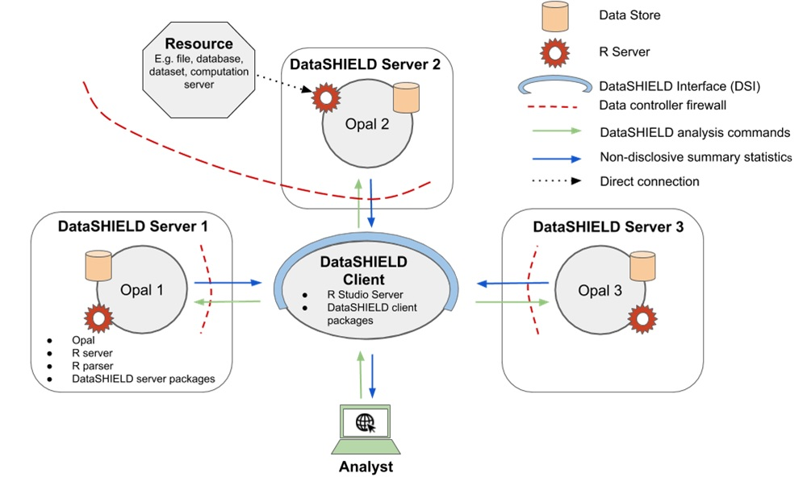
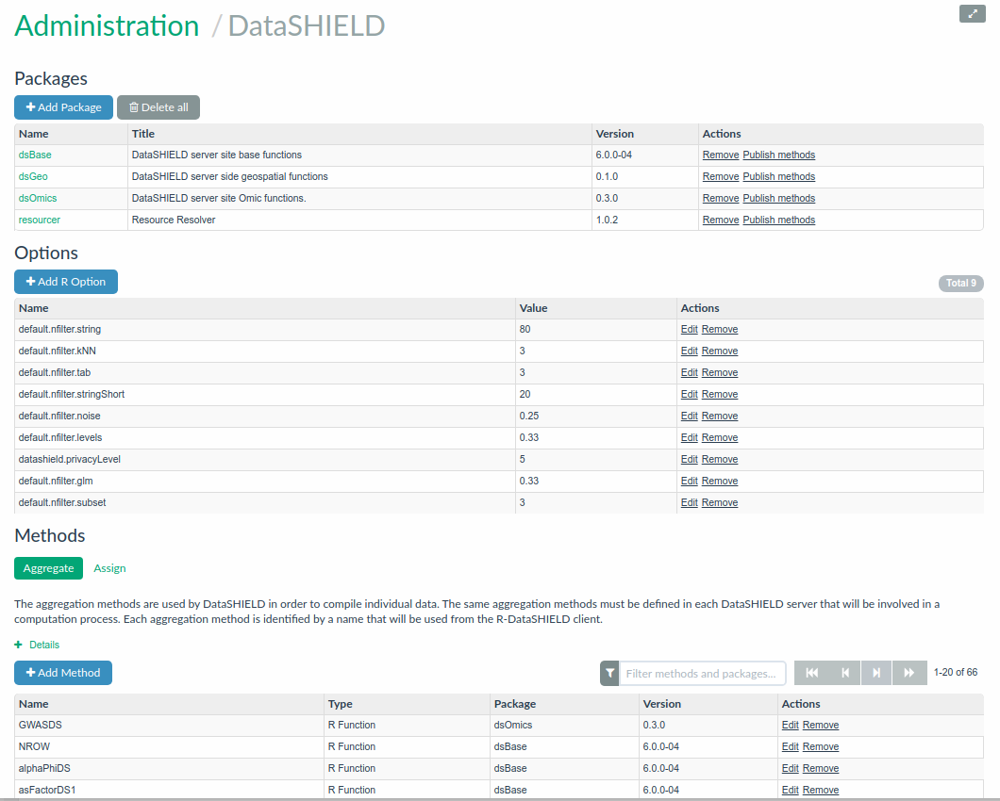
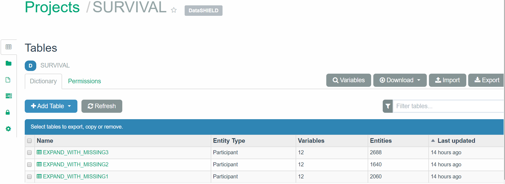

# DataSHIELD {#datashield}

## Introduction

Some research projects require pooling data from several studies to obtain sample sizes large and diverse enough for detecting interactions. Unfortunately, important ethico-legal constraints often prevent or impede the sharing of individual-level data across multiple studies. DataSHIELD aims to address this issue. DataSHIELD is a method that enables advanced statistical analysis of individual-level data from several sources without actually pooling the data from these sources together. DataSHIELD facilitates important research in settings where:
 
* a co-analysis of individual-level data from several studies is scientifically necessary but governance restrictions prevent the release or sharing of some of the required data, and/or render data access unacceptably slow, 
* equivalent governance concerns prevent or hinder access to a single dataset,
* a research group wishes to actively share the information held in its data with others but does not wish to cede control of the governance of those data and/or the intellectual property they represent by physically handing over the data themselves,
* a dataset which is to be remotely analysed, or included in a multi-study co-analysis, contains data objects (e.g. images) which are too large to be physically transferred to the site of analysis.

A typical DataSHIELD infrastructure (see Figure \@ref(fig:dsArchitec)) is composed of one central analysis node (the DataSHIELD client) connected to one or several data analysis nodes (the DataSHIELD servers). In each of these server nodes, there is a R server application which can be accessed only through a DataSHIELD compliant middleware application. This middleware application acts as a broker for managing R server sessions in a multi-user environment, assigning data and launching analysis in the R server. The analysis execution environment is then fully controlled: users must be authenticated, must have the proper permissions to access the data of interest and can only perform some predefined assignment and aggregation operations. Importantly, the operations that are permitted are designed to prevent the user having access to individual data items while still allowing useful work to be done with the data. For example, users can fit a generalised linear model to a dataset and receive information about the model coefficients, but are not given the residuals, as these could be used to reconstruct the original data.The reference implementation of this DataSHIELD infrastructure is based on the [Opal](http://opaldoc.obiba.org/) data repository. 

```{r dsArchitec, echo=FALSE, fig.cap="Typical DataSHIELD infrastructure, including one central analysis node (client) and several data nodes (servers). ", out.width = '80%', fig.align='center'}

```

The client node interacts programmatically in R with the server nodes using the DataSHIELD Interface implemented as the [DSI](https://cran.r-project.org/package=DSI) R package. The DSI defines prototype functions to authenticate the user and to perform assignment and aggregation operations in each of the R servers sitting in the server nodes. The reference implementation of DSI is the [DSOpal](https://cran.r-project.org/package=DSOpal) R package. An alternate implementation of DSI is the [DSLite](https://cran.r-project.org/package=DSLite) R package which mainly targets DataSHIELD developers by offering a pure R implementation of the whole DataSHIELD infrastructure.

## DataSHIELD R Interface (DSI)

The DataSHIELD Interface (DSI) defines a set of [S4 classes and generic methods](http://adv-r.had.co.nz/S4.html) that can be implemented for accessing a data repository supporting the DataSHIELD infrastructure: controlled R commands to be executed on the server side are garanteeing that non disclosive information is returned to client side.

### Classes Structure

The DSI S4 classes are:

Class           Description
--------------- ----------------------------------
`DSObject`      A common base class for all DSI,
`DSDriver`      A class to drive the creation of a connection object,
`DSConnection`  Allows the interaction with the remote server; DataSHIELD operations such as aggregation and assignment return a result object; DataSHIELD setup status check can be performed (dataset access, configuration comparision),
`DSResult`      Wraps access to the result, which can be fetched either synchronously or asynchronously depending on the capabilities of the data repository server.

All classes are *virtual*: they cannot be instantiated directly and instead must be subclassed. See [DSOpal](https://github.com/datashield/DSOpal) for a reference implementation of DSI based on the [Opal](http://opaldoc.obiba.org/) data repository.

These S4 classes and generic methods are meant **to be used for implementing connection to a DataSHIELD-aware data repository.**

### Higher Level Functions

In addition to these S4 classes, DSI provides functions to handle a list of remote data repository servers:

Functions                                                                                 Description
----------------------------------------------------------------------------------------- -------------------------------------------------------
`datashield.login`                                                                        Create `DSConnection` objects to the data repositories, using the `DSDriver` specification.
`datashield.logout`                                                                       Destroy the `DSConnection`s objects.
`datashield.aggregate`, `datashield.assign`                                               Typical DataSHIELD operations on `DSConnection` objects, which result will be fetched through `DSResult` objects.
`datashield.connections`, `datashield.connections_default`, `datashield.connections_find` Management of the list of `DSConnection` objects that will be discovered and used by the client-side analytic functions.
`datashield.workspaces`, `datashield.workspace_save`, `datashield.workspace_rm`           Manage R images of the remote DataSHIELD sessions (to speed up data analysis sessions).
`datashield.symbols`, `datashield.symbol_rm`                                              Minimalistic management of the R symbols living in the remote DataSHIELD sessions.
`datashield.tables`, `datashield.table_status`                                            List the tables and their accessibility across a set of data repositories.
`datashield.resources`, `datashield.resource_status`                                      List the resources and their accessibility across a set of data repositories.
`datashield.pkg_status`, `datashield.method_status`, `datashield.methods`                 Utility functions to explore the DataSHIELD setup across a set of data repositories.

These `datashield.*` functions are meant **to be used by DataSHIELD packages developers and users.**
  
### Options

Some options can be set to modify the behavior of the DSI:

Option                       Description
---------------------------- --------------------------------------
`datashield.env`             The R environment in which the `DSConnection` object list is to be looked for. Default value is the Global Environment: `globalenv()`.
`datashield.progress`        A logical to enable the visibility of the progress bars. Default value is `TRUE`.
`datashield.progress.clear`  A logical to make the progress bar disappear after it has been completed. Default value is `FALSE`. 
`datashiel.error.stop`       A logical to alter error handling behavior: if `TRUE` an error is raised when at least one server has failed, otherwise a warning message is issued. Default value is `TRUE`.


## DataSHIELD/Opal Implementation

[Opal](#opal) is a web application that is accessible through web services. It is implementing the DataSHIELD method thanks to the following built-in features:

* integration with a R server, where the DataSHIELD operations will take place,
* secure data management, with fine-grain permissions (to restrict access to individual level data),
* web services API, that allows to run Opal operations from a R script.

In addition to these features, Opal manages the DataSHIELD configuration which consists of declaring the set of the allowed aggregation/assignment R functions and some R options.

### Client

The [opalr](https://cran.r-project.org/package=opalr) R package is a general purpose Opal connection R library (authentication is required) that is used to perform various operations (authorization may be required). The [DSOpal](https://cran.r-project.org/package=DSOpal) R package is an implementation of the *DSI*, built on top of *opalr*. All the DataSHIELD operations are transparently applied to one or more Opal server using the [DSI higher-level functions](#higher-level-functions). Opal also supports asynchronous function calls (submission of a R operation, then later retrieval of the result) which allows to operate on several DataSHIELD analysis nodes in parallel.

### Server

On the Opal's R server side, some DataSHIELD-compliant R packages can be managed using the Opal's web interface: installation, removal of DataSHIELD-compliant R packages and automatic DataSHIELD configuration discovery. Opal guarantees that only the allowed functions can be called. The DataSHIELD-compliant R package guarantees that only aggregated results are returned to the client. The term 'aggregated' here means that the data in the R server will go through a function that summarizes individual-level data into a non-disclosive form. For example, obtaining the length of a vector, or obtaining the summary statistics of a vector (min, max, mean, etc.).

These DataSHIELD functions that are customisable. That is, administrators of the Opal server can add, remove, modify or create completely custom aggregating methods that are proposed to DataSHIELD clients.

```{r opalDSAdmin, echo=FALSE, fig.cap="DataSHIELD configuration in Opal", out.width = '90%', fig.align='center'}

```

When performing a DataSHIELD analysis session, a typical workflow on a single Opal analysis node is the following:

* authentication of the user (autorization to use DataSHIELD service is required),
* creation and initialization of a R server session,
* assignment of Opal-managed data into the R server session (data access authorization is required),
* processing of the incoming R operation requests (aggregation and assignment function calls authorization is required) that are forwarded to the R server session; non-disclosive aggregated result is then returned to the R client. 

### Demo

Readers can read [the DataSHIELD page in Opal documentation](http://opaldoc.obiba.org/en/latest/r-user-guide/datashield.html) to have a global overview about how to use DataSHIELD functions. It describes how to perform basic statistical analyses, linear and generalized linear models and some data visualization. A complete description of how DataSHIELD works, with lots of materials, examples, courses and real data analyses can be obtained in the [DataSHIELD Wiki](https://data2knowledge.atlassian.net/wiki/spaces/DSDEV/overview).

The following is a simple illustration of how to analyze some data available in the [Opal demo site](http://opal-demo.obiba.org/). The [Projects page](https://opal-demo.obiba.org/ui/index.html#!projects) gives access to the different projects avaialble in this Opal server. If we select the `SURVIVAL` project we see that there are three tables:

```{r survivalTables, echo=FALSE, fig.cap="Tables available in the SURVIVAL project from our Opal example", fig.align='center'}

```

First we build a connection object with user credentials and the location of the server for each of the study:

```{r survivalDemoLoginData}
library(DSOpal)
builder <- newDSLoginBuilder()
builder$append(server = "study1", url = "https://opal-demo.obiba.org", 
               user = "administrator", password = "password")
builder$append(server = "study2", url = "https://opal-demo.obiba.org", 
               user = "administrator", password = "password")
builder$append(server = "study3", url = "https://opal-demo.obiba.org", 
               user = "administrator", password = "password")
logindata <- builder$build()
logindata
```

Then we perform login into each of the analysis servers and assign for each of them a different table with the same R symbol name: 

```{r survivalDemoAssign}
conns <- datashield.login(logindata)
datashield.assign.table(conns, symbol = "D", 
                        table = list(study1 = "SURVIVAL.EXPAND_WITH_MISSING1",
                                     study2 = "SURVIVAL.EXPAND_WITH_MISSING2",
                                     study3 = "SURVIVAL.EXPAND_WITH_MISSING3"))
datashield.symbols(conns)
# TODO show up some basic analysis
```

Finaly we clean up the R server sessions: 

```{r survivalDemoLogout}
datashield.logout(conns)
```
