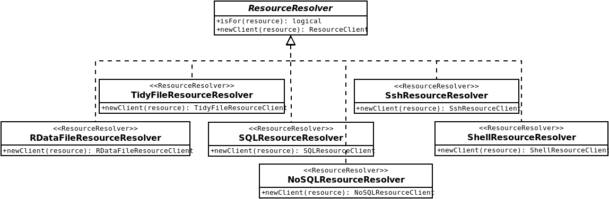

# The resourcer Package {#resourcer}

## Introduction

The `r BiocStyle::CRANpkg("resourcer")` package is an R implementation of the data and computation resources description and connection. It is reusing many existing R packages for reading various data formats and connecting to external data storage or computation servers. The resourcer package role is to interpret a resource description object to build the appropriate resource connection object. Because the bestiary of resources is very wide, the resourcer package provides a framework for dynamically extending the interpretation capabilities to new types of resources. This framework uses the object-oriented paradigm provided by the [R6 library](https://r6.r-lib.org/).

It is meant to access resources identified by a URL in a uniform way whether it references a dataset (stored in a file, a SQL table, a MongoDB collection etc.) or a computation unit (system commands, web services etc.). Usually some credentials will be defined, and an additional data format information can be provided to help dataset coercing to a data.frame object.

The main concepts are:

Class                     Description
------------------------- --------------------------------
_resource_                Access to a resource (dataset or computation unit) is described by an object with URL, optional credentials and optional data format properties.
_ResourceResolver_        A _ResourceClient_ factory based on the URL scheme and available in a resolvers registry.
_ResourceClient_          Realizes the connection with the dataset or the computation unit described by a _resource_.
_FileResourceGetter_      Connect to a file described by a _resource_.
_DBIResourceConnector_    Establish a [DBI](https://www.r-dbi.org/) connection.

## File Resources

These are resources describing a file. If the file is in a remote location, it must be downloaded before being read. The data format specification of the resource helps to find the appropriate file reader.

### File Getter

The file locations supported by default are: 

* `file`, local file system, 
* `http`(s), web address, basic authentication, 
* `gridfs`, MongoDB file store,
* `scp`, file copy through SSH,
* `opal`, [Opal](#opal) file store. 

This can be easily applied to other file locations by extending the _FileResourceGetter_ class. An instance of the new file resource getter is to be registered so that the _FileResourceResolver_ can operate as expected.

```{r eval=FALSE}
resourcer::registerFileResourceGetter(MyFileLocationResourceGetter$new())
```

### File Data Format

The data format specified within the _resource_ object, helps at finding the appropriate file reader. Currently supported data formats are:

* the data formats that have a reader in [tidyverse](https://www.tidyverse.org/): [readr](https://readr.tidyverse.org/) (`csv`, `csv2`, `tsv`, `ssv`, `delim`), [haven](https://haven.tidyverse.org/) (`spss`, `sav`, `por`, `dta`, `stata`, `sas`, `xpt`), [readxl](https://readxl.tidyverse.org/) (`excel`, `xls`, `xlsx`). This can be easily applied to other data file formats by extending the _FileResourceClient_ class.
* the R data format that can be loaded in a child R environment from which object of interest will be retrieved.

Usage example that reads a local SPSS file:

```{r eval=FALSE}
# make a SPSS file resource
res <- resourcer::newResource(
  name = "CNSIM1",
  url = "file:///data/CNSIM1.sav",
  format = "spss"
)
# coerce the csv file in the opal server to a data.frame
df <- as.data.frame(res)
```

To support other file data format, extend the _FileResourceClient_ class with the new data format reader implementation. Associate factory class, an extension of the _ResourceResolver_ class is also to be implemented and registered.

```{r eval=FALSE}
resourcer::registerResourceResolver(MyFileFormatResourceResolver$new())
```

## Database Resources

### DBI Connectors

[DBI](https://www.r-dbi.org/) is a set of virtual classes that are are used to abstract the SQL database connections and operations within R. Then any DBI implementation can be used to access to a SQL table. Which DBI connector to be used is an information that can be extracted from the scheme part of the resource's URL. For instance a resource URL starting with `postgres://` will require the [RPostgres](https://rpostgres.r-dbi.org/) driver. To separate the DBI connector instanciation from the DBI interface interactions in the _SQLResourceClient_, a _DBIResourceConnector_ registry is to be populated. The currently supported SQL database connectors are:

* `mariadb` MariaDB connector,
* `mysql` MySQL connector,
* `postgres` or `postgresql` Postgres connector,
* `presto`, `presto+http` or `presto+https` [Presto](https://prestodb.io/) connector,
* `spark`, `spark+http` or `spark+https` [Spark](https://spark.apache.org/) connector.

To support another SQL database having a DBI driver, extend the _DBIResourceConnector_ class and register it:

```{r eval=FALSE}
resourcer::registerDBIResourceConnector(MyDBResourceConnector$new())
```

### Use dplyr

Having the data stored in the database allows to handle large (common SQL databases) to big (PrestoDB, Spark) datasets using [dplyr](https://dplyr.tidyverse.org/) which will delegate as much as possible operations to the database.

### Document Databases

NoSQL databases can be described by a resource. The [nodbi](https://docs.ropensci.org/nodbi/) can be used here. Currently only connection to MongoDB database is supported using URL scheme `mongodb` or `mongodb+srv`.

## Computation Resources

Computation resources are resources on which tasks/commands can be triggerred and from which resulting data can be retrieved.

Example of computation resource that connects to a server through SSH:

```{r eval=FALSE}
# make an application resource on a ssh server
res <- resourcer::newResource(
  name = "supercomp1",
  url = "ssh://server1.example.org/work/dir?exec=plink,ls",
  identity = "sshaccountid",
  secret = "sshaccountpwd"
)
# get ssh client from resource object
client <- resourcer::newResourceClient(res) # does a ssh::ssh_connect()
# execute commands
files <- client$exec("ls") # exec 'cd /work/dir && ls'
# release connection
client$close() # does ssh::ssh_disconnect(session)
```


## Interacting with R Resources

As the _ResourceClient_ is just a connector to a resource, to make this useful some data conversion functions are defined by default:

* R data.frame, which is the most common representation of tabular data in R. A data frame, as defined in R base, is an object stored in memory that may be not suitable for large to big datasets. 
* [dplyr](https://dplyr.tidyverse.org/) tbl, which is another representation of tabular data that nicely integrates with the DBI: filtering, mutation and aggregation operations can be delegated to the underlying SQL database, reducing the R memory and computation footprint. Useful functions are also provided to perform join operations on relational datasets. A data.frame can be accessed as a tbl and vice versa.

In the case when the resource is a R object, the _RDataFileResourceClient_ offers the ability to get the internal raw data object. Then complex data structures, optimized for a specific research domain can be accessed with the most appropriate tools.

When the resource is a computation service provider, the interaction with the resource client will consist of issuing commands/requests with parameters and getting the result from it either as a response object or as a file to be downloaded.

Another way of interacting with a resource is to get the internal connection object (a database connector, a SSH connector etc.) from the _ResourceClient_ and then apply any kind of operations that are defined for it. The general purpose of a resource is not to substitute itself to the underlying library, it is to facilitate the access to the related data and services.

## Extending Resources {#extending_resources}

There are several ways to extend the Resources handling. These are based on different R6 classes having a `isFor(resource)` function:

* If the resource is a file located at a place not already handled, write a new _FileResourceGetter_ subclass and register an instance of it with the function `registerFileResourceGetter()`.
* If the resource is a SQL engine having a DBI connector defined, write a new _DBIResourceConnector_ subclass and register an instance of it with the function `registerDBIResourceConnector()`.
* If the resource is in a domain specific web application or database, write a new _ResourceResolver_ subclass and register an instance of it with the function `registerResourceResolver()`. This _ResourceResolver_ object will create the appropriate _ResourceClient_ object that matches your needs.

The design of the URL that will describe your new resource should not overlap an existing one, otherwise the different registries will return the first instance for which the `isFor(resource)` is `TRUE`. In order to distinguish resource locations, the URL's scheme can be extended, for instance the scheme for accessing a file in a Opal server is `opal+https` so that the credentials be applied as needed by Opal.

In order to simplify the usage of these resource client classes, the resourcer package combines several software design patterns:

* The factory pattern, a classic [creational design pattern](https://en.wikipedia.org/wiki/Factory_method_pattern). It is realized by the _ResourceResolver_ R6 class which is responsible for making a _ResourceClient_ object matching a provided resource object.
* The registry pattern, “a well-known object that other objects can use to find common objects and services” as [described by M. Fowler](https://martinfowler.com/eaaCatalog/registry.html). It is basically a global list of objects to iterate to find the appropriate one. In the resourcer package there are several registries: (1) the registry of _ResourceResolver_ objects (the ResourceClient factories), (2) the registry of _FileResourceGetter_ objects and (3) the registry of _DBIResourceConnector_ objects.
* The self-registration pattern, which consists of delegating the registration of new services to their provider. The [package event mechanism of R](https://stat.ethz.ch/R-manual/R-devel/library/base/html/ns-hooks.html) is used so that a R package self-registers its resource components in the previously mentioned registries when the package is loaded at runtime.

For implementing _ResourceClient_ factories the resourcer package provides different _ResourceResolver_ classes (see Figure \@ref(fig:resourceResolver)):

* for file resources, which will discriminate the resources based on the URL property (checking if any _FileResourceGetter_ exists for that resource) and the data format property (for getting additional information about how to read the data). The _FileResourceGetter_ can be extended to new file locations: as an example, the aws.resourcer R package is able to get resource files from Amazon Web Service S3 file stores.
* for database resources, which will discriminate the resources based on the scheme part of the URL (checking if any _DBIResourceConnector_ can be found or whether a nodbi connector can be created). The _DBIResourceConnector_ can be extended to new DBI implementations. For instance, using [bigrquery](https://cran.r-project.org/package=bigrquery) R package, it would be easy to implement access to a resource stored in a Google’s BigQuery database.
* for command-based computation resources, which will discriminate the resources based on the scheme part of the URL, indicating how to issue commands (local shell or secure remote shell).

```{r resourceResolver, echo=FALSE, fig.cap="ResourceResolver class diagram", fig.align='center'}

```

Additional _ResourceResolver_ and _ResourceClient_ extensions could be implemented for accessing domain specific applications which would expose data extraction and/or analysis services, the only requirement is that a R connection API exists for the considered application.

The process of creating a new _ResourceClient_ instance from a resource object consists of iterating over a registry of _ResourceResolver_ instances and finding the one that can handle the resource object by inspecting its properties (URL, data format etc.). The URL property inspection can imply a lookup in the additional registries: if the resource is a data file, the file resource resolvers will check in the _FileResourceGetter_ registry whether there is one that applies; if the resource is a DBI-compatible database, the SQL resource resolver will check in the _DBIResourceConnector_ registry whether there is one that applies. This workflow is simply triggered by a resourcer’s function call.

## Resource Forms

As it can be error prone to define a new resource, when a URL is complex, or when there is a limited choice of formats or when credentials can be on different types, it is recommended to declare the resources forms and factory functions within the R package. This resource declaration is to be done in javascript, as this is a very commonly used language for building graphical user interfaces.

These files are expected to be installed at the root of the package folder (then in the source code of the R package, they will be declared in the `inst/resources` folder), so that an external application can lookup statically the packages having declared some resources.

The configuration file `inst/resources/resource.js` is a javascript file which contains an object with the properties:

* `settings`, a JSON object that contains the description and the documentation of the web forms (based on the [json-schema](http://json-schema.org) specification).
* `asResource`, a javascript function that will convert the data captured from one of the declared web forms into a data structure representing the `resource` object.

As an example (see also [resourcer's resource.js](https://github.com/obiba/resourcer/blob/master/inst/resources/resource.js)):

```javascript
var myPackage = {
  settings: {
    "title": "MyPackage resources",
    "description": "MyPackage resources are for etc.",
    "web": "https://github.com/org/myPackage",
    "categories": [
      {
        "name": "my-format",
        "title": "My data format",
        "description": "Data are files in my format, that will be read by myPackage etc."
      }
    ],
    "types": [
      {
        "name": "my-format-http",
        "title": "My data format - HTTP",
        "description": "Data are files in my format, that will be downloaded from a HTTP server etc.",
        "tags": ["my-format", "http"],
        "parameters": {},
        "credentials": {}
      }
    ]
  },
  asResource: function(type, name, params, credentials) {
    // make a resource object from arguments, using type to drive 
    // what params/credentials properties are to be used
    // a basic example of resource object:
    return {
      "name": name,
      "url": params.url,
      "format": params.format,
      "identity": credentials.username,
      "secret": credentials.password
    };
  }
}
```

The specifications for the `settings` object is the following:

Property         Type                Description
---------------- ------------------- ------------------
**title**        `string`            The title of the set of resources.
**description**  `string`            The description of the set of resources.
**web**          `string`            A web link that describes the resources.
**categories**   `array` of `object` A list of `category` objects which are used to categorize the declared resources in terms of resource location, format, usage etc.
**types**        `array` of `object` A list of `type` objects which contains a description of the parameters and credentials forms for each type of resource.

Where the `category` object is:

Property        Type     Description
--------------- -------- --------------------------
**name**        `string` The name of the category that will be applied to each resource `type`, must be unique.
**title**       `string` The title of the category.
**description** `string` The description of the category.

And the `type` object is:

Property        Type                Description
--------------- ------------------- ---------------------
**name**        `string`            The identifying name of the resource, must be unique.
**title**       `string`            The title of the resource.
**description** `string`            The description of the resource form.
**tags**        `array` of `string` The `tag` names that are applied to the resource form.
**parameters**  `object`            The form that will be used to capture the parameters to build the *url* and the *format* properties of the resource (based on the [json-schema](http://json-schema.org) specification). Some specific fields can be used: `_package` to capture the R package name or `_packages` to capture an array of R package names to be loaded prior to the resource assignment. 
**credentials** `object`            The form that will be used to capture the access credentials to build the *identity* and the *secret* properties of the resource (based on the [json-schema](http://json-schema.org) specification).


The `asResource` function is a javascript function which signature is `function(type, name, params, credentials)` where:

* `type`, the form name used to capture the resource parameters and credentials,
* `name`, the name to apply to the resource,
* `params`, the captured parameters,
* `credentials`, the captured credentials.
  
The name of the root object must follow the pattern: `<R package>` (note that any dots (`.`) in the R package name are to be replaced by underscores (`_`)).

A real example of how to create this file for the `{r Githubpkg("isglobal-brge", "dsOmics")} package (described in [this Section](#omic_extension)) can be found [here](https://github.com/isglobal-brge/dsOmics/blob/master/inst/resources/resource.js).

## Examples of Resources

Let us illustrate how to deal with different types of resources within DataSHIELD. To this end, let use our Opal test example available at https://opal-demo.obiba.org which has the following reources 

```{r testResources2, echo=FALSE, fig.cap="Resources from a test enviroment available at https://opal-demo.obiba.org", fig.align='center'}
knitr::include_graphics("fig/opal_resources.png", dpi=NA)
```

Let us start by illustrating how to get a simple TSV file (brge.txt) into the R server. This file is located at a GitHub repository: https://raw.githubusercontent.com/isglobal-brge/brgedata/master/inst/extdata/brge.txt and it is not necesary to be moved from there. This is one of the main strenght of the resources implementation.

### TSV File into a tibble or data.frame

This code describes how to get the resource (a TSV file) as a data.frame into the R Server. Note that this is a secure access since user name and password must be provided

```{r load_tsv}
library(DSOpal)
library(dsBaseClient)

# access to the 'brge' resource (NOTE: RSRC.brge is need since the project
# is called test)
builder <- newDSLoginBuilder()
builder$append(server = "study1", url = "https://opal-demo.obiba.org", 
               user = "dsuser", password = "password", 
               resource = "RSRC.brge", driver = "OpalDriver")
logindata <- builder$build()

# the resource is loaded into R as the object 'res' 
conns <- datashield.login(logins = logindata, assign = TRUE, 
                               symbol = "res")

# the resource is assigned to a data.frame
# Assign to the original R class (e.g ExpressionSet)
datashield.assign.expr(conns, symbol = "dat", 
                       expr = quote(as.resource.data.frame(res)))

ds.class("dat")

# logout the connection
datashield.logout(conns)
```


### R Data File into a R object

Now let us describe how to get an specific type of R object into de R server. Our Opal test contains a resource called GSE80970 which is in a local machine. The resource is an R object of class [ExpressionSet](https://kasperdanielhansen.github.io/genbioconductor/html/ExpressionSet.html) which is normally used to jointly capsulate gene expression, metadata and annotation. In general, we can retrieve any R object in their original format and if a method to coerce the specific object into a data.frame exists, we can also retrieve it as a tibble/data.frame. 

```{r load_eSet}
# prepare login data and resource to assign
builder <- newDSLoginBuilder()
builder$append(server = "study1", url = "https://opal-demo.obiba.org", 
               user = "dsuser", password = "password", 
               resource = "RSRC.GSE80970", driver = "OpalDriver")
logindata <- builder$build()

# login and assign resource (to 'res' symbol)
conns <- datashield.login(logins = logindata, assign = TRUE, 
                               symbol = "res")

# coerce ResourceClient objects to a data.frame called 'DF' 
# NOTE: as.data.frame exists for `ExpressionSet` objects
datashield.assign.expr(conns, symbol = "DF",  
                       expr = quote(as.resource.data.frame(res)))

ds.class("DF")

# we can also coerce ResourceClient objects to their original format.
# This will allow the analyses with specific R/Bioconductor packages
datashield.assign.expr(conns, symbol = "ES", 
                       expr = quote(as.resource.object(res)))

ds.class("ES")

# logout the connection
datashield.logout(conns)
```

