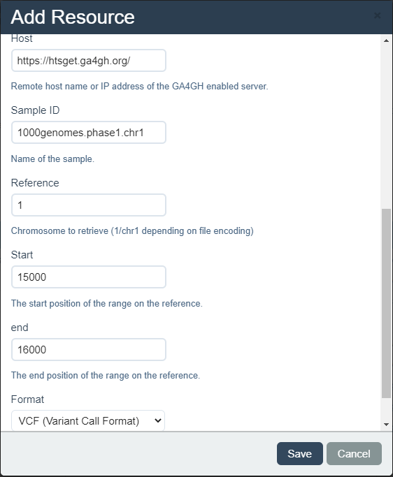
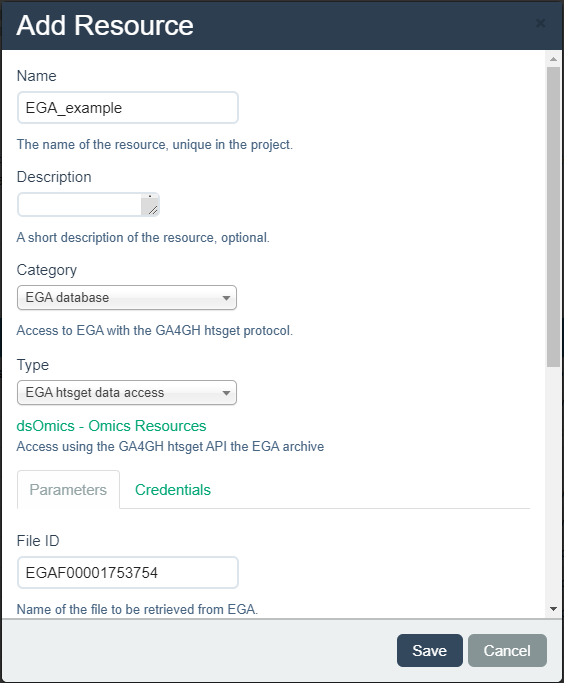
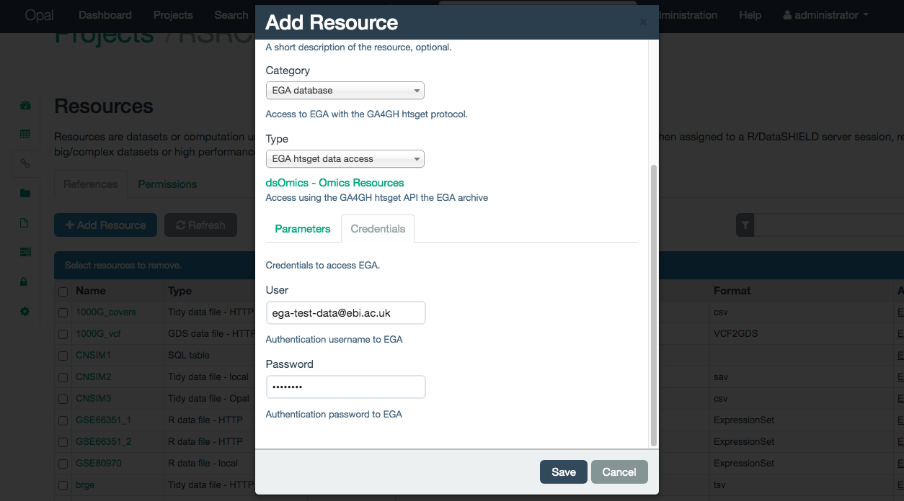

# Extension to GA4GH and EGA (BAM/VCF files)

The Global Alliance for Genomics and Health (GA4GH) has a wide [toolkit](https://www.ga4gh.org/genomic-data-toolkit/) focused on many aspects of the study of the genome. One of the aspects is the distribution of data, which ensures safe transfer protocols for data providers to grant access to their data. 

The [htsget API](https://samtools.github.io/hts-specs/htsget.html) is a standard developed by GA4GH which focuses on the streaming of BAM (Binary version of a SAM file) and VCF (Variant Call Format) files. In order to connect to open data servers that have the htsget API implemented, a [Client and a Resolver](#extending_resources) have been located in the `r Biocpkg("dsOmics")` package. In order to integrate this resource into the `r Biocpkg("dsOmics")` analysis pipeline, the BAM and VCF files are treated using the functions `snpgdsVCF2GDS` and `BAM2VCF` to obtain a [Genomic Data Storage](https://bioconductor.org/packages/release/bioc/vignettes/gdsfmt/inst/doc/gdsfmt.html#introduction) (GDS) object.

The generic resource implemented for the GA4GH htsget API allows the connection to open databases, federated databases that have the same protocol implemented rely on different authentication processes in order to allow the streaming of data files, for that reason they have to be implemented on a case to case basis.

The European Genome-Phenome Archive (EGA) is a federated database that has the htsget API implemented. In order to stream data, an authentication using [OAuth2.0](https://oauth.net/2/) is required. Following the general htsget resource implementation, a [Client and a Resolver](#extending_resources) have been located in the `r Biocpkg("dsOmics")` package. The difference to use this resource is that it does not require an URL, as the EGA-htsget endpoint is static, and that a user and password has to be provided to perform the authentication to EGA.

## Upload GA4GH and EGA resources into OPAL

### Manually

#### GA4GH {#Manual-GA4GH}

To upload a GA4GH htsget resource into OPAL, the first steps to follow are already described [here](#create_manually). The particularities of GA4GH htsget resources come to the last step, when inputing the resource parameters. 

The resource category to select is *GA4GH htsget*. The resouce has to be named and an optional description can be provided if desired (Illustrated on the Figure \@ref(fig:htsget1)).

```{r htsget1, echo=FALSE, fig.cap="Naming a GA4GH htsget resource", out.height= '5%', fig.align='center'}
knitr::include_graphics("fig/opal_resource_htsget1.png")
```

Once named, some additional paramters have to be inputed to define the resource (all of them are mandatory):

+ Host: URL of the server to which stream data.
+ File ID: Name of the VCF/BAM file on the server.
+ Chromosome: Name of the chromosome to filter the selected file. The enconding has to match the selected file, if the file uses UCSC enconding use "chr1" if it uses NCBI use "1". Contact the data provider if in doubt.
+ Start: The start position of the filter.
+ End: The end position of the filter.
+ Format: Format of the file, this field can take two values
  + VCF: To select a filtered VCF file
  + BAM: To select a filtered BAM file
  
This parameters are illustrated on the Figure \@ref(fig:htsget2)

```{r htsget2, echo=FALSE, fig.cap="Selecting the parameters on a GA4GH htsget resource", out.height= '5%', fig.align='center'}

```

#### EGA {#Manual-EGA}

To upload a EGA htsget resource into OPAL, the first steps to follow are already described [here](#create_manually). The particularities of EGA htsget resources come to the last step, when inputing the resource parameters. 

The resource category to select is *EGA database*. The resouce has to be named and an optional description can be provided if desired (Illustrated on the Figure \@ref(fig:htsgetEGA1)).

```{r htsgetEGA1, echo=FALSE, fig.cap="Naming a EGA database resource", out.height= '5%', fig.align='center'}

```

Once named, some additional paramters have to be inputed to define the resource (all of them are mandatory):

+ File ID: Name of the VCF/BAM file on EGA.
+ Chromosome: Name of the chromosome to filter the selected file. The enconding has to match the selected file, if the file uses UCSC enconding use "chr1" if it uses NCBI use "1". Contact the data provider if in doubt.
+ Start: The start position of the filter.
+ End: The end position of the filter.
+ Format: Format of the file, this field can take two values
  + VCF: To select a filtered VCF file
  + BAM: To select a filtered BAM file
  
This parameters are illustrated on the Figure \@ref(fig:htsgetEGA2)

```{r htsgetEGA2, echo=FALSE, fig.cap="Selecting the parameters on a EGA database resource", out.height= '5%', fig.align='center'}
knitr::include_graphics("fig/opal_resource_htsgetEGA2.png")
```

Access to the EGA database is controlled via a user and password combination that grants access to different files on the server. For that, they are mandatory to create the resource. They have to be inputed on the *Credentials* tab, illustrated on the Figure \@ref(fig:htsgetEGA3).

```{r htsgetEGA3, echo=FALSE, fig.cap="Credentials tab for EGA database resource", out.height= '5%', fig.align='center'}

```

### Using R

#### GA4GH


A GA4GH htsget  can be added to a given OPAL project by a simple function call. This process requires to exactly write the the URL. To automate this, a function exists on `dsOmicsClient` that creates the URLs, this function takes the following parameters:

+ url: URL of the server
+ id: ID of the file on the server
+ chr: Chromosome to filter (encoding is server dependant)
+ start: Start position to filter
+ end: End position to filter
+ type: Type of file (VCF/BAM)

```{r eval=FALSE}
# BAM FILES
bam_url <- get_ga4gh_url(url = "https://htsget.ga4gh.org",
              id = "giab.NA12878.NIST7035.2",
              chr = "chr21",
              start = 1,
              end = 20000000,
              type = "BAM")
bam_url

# VCF FILES
vcf_url <- get_ga4gh_url(url = "https://htsget.ga4gh.org",
              id = "1000genomes.phase1.chr1",
              chr = "1",
              start = 15000,
              end = 16000,
              type = "VCF")
vcf_url
```


Then, the R code to create this resource from the VCF file in OPAL is:


```{r eval = FALSE}
library(opalr)
o <- opal.login("administrator","password", 
                url="https://opal-demo.obiba.org")

opal.resource_create(o, "RSRC", "ga4gh_1000g", 
  url = vcf_url
  format = "GA4GHVCF")

opal.resource_create(o, "RSRC", "giab", 
  url = bam_url
  format = "GA4GHBAM")

# to test the resource assignment
opal.assign.resource(o, "client", "RSRC.ga4gh_1000g")
opal.assign.resource(o, "client", "RSRC.giab")
opal.execute(o, "class(client)")

opal.logout(o)
```

#### EGA

A EGA database can be added to a given OPAL project by a simple function call. This process requires to exactly write the the URL where the genomic data file is located. To automate this, a function exists on `dsOmicsClient` that creates the URLs, this function takes the following parameters:

+ id: ID of the EGA file
+ chr: Chromosome to filter (encoding is file dependant)
+ start: Start position to filter
+ end: End position to filter

```{r eval=FALSE}
# Same URL style for BAM and VCF
ega_url <- get_EGA_url("EGAF00001753756", "chr21", 1, 100)
ega_url
```

Then, the R code to create this resource in OPAL is:

```{r eval = FALSE}
library(opalr)
o <- opal.login("administrator","password", 
                url="https://opal-demo.obiba.org")

opal.resource_create(o, "RSRC", "EGA", 
  url = ega_url
  format = "EGAhtsgetBAM", # format = "EGAhtsgetVCF" for VCF files
  identity = "ega-test-data@ebi.ac.uk", # This is the test user
  secret = "egarocks" # This is the test password
  ) 

# to test the resource assignment
opal.assign.resource(o, "client", "RSRC.EGA")
opal.execute(o, "class(client)")

opal.logout(o)
```

## Adding a genomic resource

To load the presented resources into the study servers, the standard procedure already presented on this Bookdown has to be followed (see [here]()).

```{r load_opal_ga4gh}
library(DSI)
library(DSOpal)
library(dsBaseClient)
library(dsOmicsClient)

builder <- newDSLoginBuilder()
builder$append(server = "study1", url = "https://opal-demo.obiba.org",
               user = "dsuser", password = "password",
               resource = "RSRC.ga4gh_1000g", driver = "OpalDriver")
logindata <- builder$build()

conns <- datashield.login(logins = logindata, assign = TRUE,
                          symbol = "ga4gh")
datashield.assign.expr(conns, symbol = "ga4gh_gds", 
                       expr = quote(as.resource.object(ga4gh)))
```

Now we can see that the resource is loaded in the study server as a GDS

```{r clasgagh}
ds.class("ga4gh_gds")
```

## Descriptive omic data analysis

Since the presented resources load GDS objects into the study servers, the same procedures introduced on [this same bookdown](#gwasBioc) can be applied. As an example, a PCA can be performed on the loaded data from a GA4GH htsget server that holds the 1000 Genome dataset. This example resource contains SNPs of the first human chromosome ranging from the start of it to the position 100000.

```{r pcaGA4GH, fig.cap='PCA over the 1000 genomes dataset available at GA4GH '}
ds.PCASNPS("ga4gh_gds")
```

For further descriptive analysis such as Hardy-Weinberg Equilibrium testing and Allelic frequency, a phenotypes (or covariates) table has to be provided and bundled through the `ds.GenotypeData` function, this table has to have at least information about the gender of the individuals.

This closes the access to the resources

```{r close_ga4gh}
datashield.logout(conns)
```