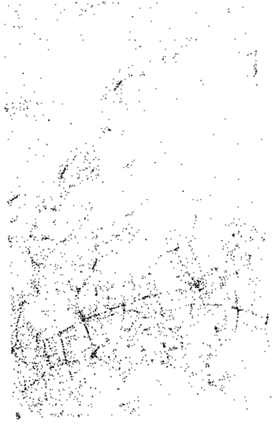

# Geospatial data analysis {#GIS}

In this section we will provide some realistic data anlyses of geographic data including Geospatial Positionning System (GPS) and geolocation data, which is then combined with phenotypic data.  The objectives of the analyses are intended to mimic the real-life usage of data covered in REF BURGOINE ET AL.

## Introducing the analysis

In this example we consider GPS traces captured by individuals in some eastern districts of London, publically available from [OpenStreetMap](https://www.openstreetmap.org/).  For this example analysis, we will imagine these 819 GPS traces as commutes between individuals' home and work. If these data were actual commutes, they would be highly sensitive as they identify an individual’s home and work location. Therefore it is less likely that commuting data would be readily accessible for traditional pooled analysis and a federated approach with DataSHIELD could be more practical. We also have real data on the location of 6100 fast food or takeaway outlets in this same area, sourced from the [Food Standards Agency](https://api.ratings.food.gov.uk/). This is shown in the figure below. We manufactured a corresponding data set on individuals’ BMI, age, sex, total household income, highest educational qualification (as proxies for individual level socioeconomic status) and smoking status. The purpose of the analysis is to test the association between exposure to takeaway food on a commute with BMI, using the other variables to adjust for confounding factors. Given that reducing obesity is a public health priority, this type of research could help inform local authority policies towards food outlet location, type and density. We illustrate how the tools available in the dsGeo package allow this question to be addressed.

```{r commutes, echo=FALSE, fig.cap="GPS traces in eastern London which could be imagined to be commutes between homes and workplaces", fig.align='center'}
knitr::include_graphics("fig/commutes.png")
```
```{r takeaways, echo=FALSE, fig.cap="Location of food outlets in eastern London", fig.align='center'}

```

## Setting up the analysis
THE DATA ARE NOT CURRENTLY SPLIT, BUT COULD DO THIS AT A LATER DATE WHEN IT IS ALL WORKING OK
 
In order to perform geospatial data analyses, we need first to login and assign resources to DataSHIELD. This can be performed using the `as.resource.object()` function. The data have been uploaded to the server and configured as resources.

```{r login_assign_GIS}
builder <- DSI::newDSLoginBuilder()
builder$append(server = "study1", url = "https://opal-demo.obiba.org", 
               user = "dsuser", password = "password", 
               resource = "RSRC.gps_data", driver = "OpalDriver")

logindata <- builder$build()

conns <- DSI::datashield.login(logins = logindata, assign = TRUE, 
                               symbol = "gps.res")

# Assign additional datasets as resources for the location of the food outlets / takeaways and
# the participant phenotype data

datashield.assign.resource(conns, symbol="takeaway.res", resource="RSRC.takeaway_gps")
datashield.assign.resource(conns, symbol="participant.res", resource="RSRC.gps_participant")

# Assign to the original R classes (e.g Spatial)

datashield.assign.expr(conns, symbol = "takeaway",
                       expr = quote(as.resource.object(takeaway.res)))

datashield.assign.expr(conns, symbol = "journeys",
                       expr = quote(as.resource.object(gps.res)))

datashield.assign.expr(conns, symbol = "participant",
                       expr = quote(as.resource.data.frame(participant.res)))

```
Now, we can see that the resources are loaded into the R servers as their original class

```{r assign_GIS}
ds.class("takeaway")
ds.class("journeys")
ds.class("participant")
```

In the same way that BioConductor provides convenient data structures for 'omics data, the sp package allows each row of data to have a corresponding set of geometries. So if a row of data has information about an individual (age, BMI, etc.) it can also have a set of many points defining geometries such as points, lines and polygons.

```{r show_data}
# Standard ds.summary can be used on the 'data' part of the spatial dataframe
ds.summary('journeys$age')
```

We have provided an additional function to allow a summary of the geometries to be provided.

```{r geom_summary}
ds.geoSummary('journeys')
```

## Data manipulation

In our analysis we need to define how we determine whether an individual has been 'exposed' to a food outlet. First we will define a 10m buffer around the location of the food outlet. If an indivudal's GPS trace falls within that buffered region, we will say that they are 'exposed' to that outlet. The food outlets are defined as points, and after the buffer is applied they become polygons.

```{r add_buffer}
# Add a buffer to each takeaway - now they are polygons
ds.gBuffer(input = 'takeaway', ip_width=10, newobj.name = 'take.buffer', by_id=TRUE)
ds.geoSummary('take.buffer')
```

To simplify the next step, we remove the data part of the `SpatialPolygonsDataFrame` to leave the polygons

```{r remove_data}
#extract the polygons
ds.geometry(input_x = 'take.buffer', newobj.name = 'take.buffer.strip')
ds.geoSummary('take.buffer.strip')
```

Now, we take the intersection of each individual's commute with each food outlet as shown in the figure below.

```{r intersection, echo=FALSE, fig.cap="Food outlets with a buffer are shown by a cross surrounded by a circle. The line segments represent the GPS trace. In this case there is an intersection with 2 of the 3 food outlets.", fig.align='center'}

```

This results in a list of individuals, with each list element being a numeric vector containing the ids of the food outlet buffers that were intersected by the GPS trace. These are the food outlets that the individual was 'exposed' to. We then convert the numeric vectors to counts by applying the `length` function to the list.

```{r over}
# Do the intersection of journeys with buffered takeaways
ds.over(input_x = 'journeys', input_y = 'take.buffer.strip',
        newobj.name = 'my.over', retList = TRUE)
ds.lapply(input = 'my.over',newobj.name = 'count.list', fun = 'length')
```

The result of the lapply needs to be unlisted, and we check the result looks reasonable

```{r unlist}
ds.unList(x.name = 'count.list', newobj='counts')
ds.summary('counts')
```

## Generating the final result

Finally we complete the association analysis and see that BMI is positively associated with the count of food outlets that an individual is exposed to on commutes (see the 'counts' coefficient). This type of analysis could be used to convey a public health message about density and location of takeaway food outlets. 

```{r analysis}
ds.dataFrame(x = c('participant', 'counts'), newobj = 'geo.df')
result <- ds.glm(formula = 'BMI ~ age + sex + inc + fsmoke + fedu + counts', 
                data = 'geo.df', family = 'gaussian')
result$coefficients
```