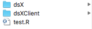

# Creating DataSHIELD packages {#package_info}

The procedure for the development of a client-side or a server-side package in DataSHIELD is similar as the procedure of creating packages in native R and RStudio. For the development of a package, the developer will need the R packages [devtools](https://cran.r-project.org/web/packages/devtools/readme/README.html) and [roxygen2](https://cran.r-project.org/web/packages/roxygen2/index.html). Having those packages installed and loaded in the R session, the developer should follow five basic steps:

(1) [Create](https://www.rdocumentation.org/packages/devtools/versions/2.2.2/topics/create) the package directory: this will create the R and the man folders and the DESCRIPTION file in a specified directory. 

(2) Add functions: copy the R scripts of the functions developed in the R folder created at step (1).

(3) Add documentation: add comments at the beginning of each function to give information to the user on what the function does and how the arguments of the function are used. Those comments are compiled into the correct format for the package documentation. More details can be found in the roxygen2 [documentation](https://roxygen2.r-lib.org).

(4) Create the documentation: this automatically adds in the .Rd files to the man directory and a NAMESPACE file to the main package directory. (see the function [document](https://www.rdocumentation.org/packages/devtools/versions/2.3.0/topics/document) in devtools)

(5) [Install](https://www.rdocumentation.org/packages/devtools/versions/2.3.0/topics/install) the development package.

In addition to those steps, the developer can make the package a GitHub repo and allows other developers to commit any further developments and improvements. For more details the reader can have a look on a Git/GitHub [guide](https://kbroman.org/github_tutorial/).

After the development of a client-server pair of DataSHIELD packages the DataSHIELD Development Team can provide a testing framework where the developed functions and packages are tested including tests related to disclosure protection and if all tests are passed, then the package can be become publicly available for use by the DataSHIELD users. Details for the DataSHIELD testing framework can be found in the DataSHIELD [Wiki](https://data2knowledge.atlassian.net/wiki/spaces/DSDEV/pages/658505761/Testing).


## Example of DataSHIELD package development

The following section contains an example on how to setup a whole environment to develop DataSHIELD packages using DSLite and RStudio, as well as a guided illustration of how to create a new functionality. It is targeted at new developers of DataSHIELD packages that need some guidance on the first steps. Please note that anything described on this section is just a template and can be modified and adapted to anyone liking, take it as a starting point.

### Folders and files {#fandfiles}

To speed up the development process, the most practical approach to setting up the folders and files is illustrated on the Figure \@ref(fig:developmentproposition1). The idea is to have two folders that contain each one a package, that means one to be used in the client and one on the server (virtualized server on this development approach); outside those two folders there is the testing script that will be used to call the new functions.

```{r developmentproposition1, echo=FALSE, fig.cap="Folders and files proposal", out.height= '55%', fig.align='center'}

```

Inside each folder, a typical R package structure is to be found. This is further detailed [here](#package_info) and [here](https://r-pkgs.org/). If the reader does not have prior experience on R package development, there is the option of setting up a package folder through:

```
RStudio -> File -> New Project... -> New Directory -> R Package 
```

The typical style convention for DataSHIELD is to name the client package as *dsXClient* and the associated server package as *dsX*. The client package will contain the functions that the user will use, those functions will be basically triggers to the server functions, more information about that on the following lines.

### Development of a function

There is many information about [DataSHIELD](https://data2knowledge.atlassian.net/wiki/spaces/DSDEV/overview) and how it works. A very brief introduction will be provided on this section to help.

When developing a function, we have to develop both the server function and the client function. The aim of the client function (your RStudio instance) is to send an instruction to the server that will or will not have a return to you; and the aim of the server function is to perform an action(s) on an object that it contains, and make sure that if there is an output to the client, it is non disclosive.

We have already described a classification between functions that do and do not have outputs to the client, in DataSHIELD they are called `AGGREGATE` functions (output to the client) and `ASSIGN` functions (NO output to the client).

It is important to always have in mind that the objects that are being manipulated only exist on the servers, and not on the client, with that in mind let's take a look at a basic client function.

```{r exampleClient1, eval = FALSE}
ds.basicFunction <- function(object, option) {
  
}
```

This is a basic function that will modify an object on the server that has one option parameter. Before writing any more code, let's take a minute to understand that the `object` variable and `option` variable will be strings, since they do not exist on the client side. The `object` variable is the name of the object that we want to modify on the server, and the `option` variable is a string that in this example will refer to a bool (TRUE/FALSE).

Let's now build the function call that will be done on the client.

```{r exampleClient2}
ds.basicFunction <- function(object, option) {
 
  cally <- paste0("basicFunctionDS(", object, ", ", option, ")")
  return(cally)
   
}

ds.basicFunction("dataset1", "FALSE")
```

As it can be seen, we have now created a string that contains a function call that we want to execute on the server, the only thing left to do is to send this instruction to the server. Before doing that let's make clear the style used here. For the client functions we use ds.X and the associated server function is named XDS. Now we can use as example the following function that we have created on our server package.

```{r exampleServer1, eval = FALSE}
basicFunctionDS <- function(object, option){
  if(option){
    object <- sum(object)
  }
  else{
    object <- mean(object)
  }
  return(object)
}
```

What needs to be noted about the example server function is 1) Here we are using the input arguments of the functions as R objects, since this will be executed on a server that is expected to have them. On this particular example `object` must be a numerical vector and `option` a bool (this is a very simple example with no class checking of the arguments); 2) We have a return, so this can be an `AGGREGATE` or `ASSIGN` function, more information on that in the following lines, no need to worry at this stage.

Having explained the server function, let's now retake the client function. We now have our server function defined and what is left to be done is to actually call it. To do so we make use of the DSI package, at this point is when we have to decide if the function call will be `AGGREGATE` or `ASSIGN`.

```{r exampleClient3,eval = FALSE}
# AGGREGATE
DSI::datashield.aggregate(conns, as.symbol(cally))

# ASSIGN
DSI::datashield.assign.expr(conns, name, as.symbol(cally))
```

The return of the server function will be passed to the client on a `AGGREGATE` function and it will be assigned to a new object (on the server) on a `ASSIGN` function.

If we want to create a function that will have an output to the client, we use `DSI::datashield.aggregate`, this function needs a connection object and the previously formatted string; while if we just want to create a new object on the server we use `DSI::datashield.assign.expr`, this function also needs the connection object as well as a string (`name` on the example) that indicates the name the new object will have on the server. Let's say for this example we are creating a `AGGREGATE` function, our final function will look like this:

```{r exampleClient4, eval = FALSE}
ds.basicFunction <- function(object, option, datasources = NULL) {
 
  if (is.null(datasources)) {
    datasources <- DSI::datashield.connections_find()
  }
  
  cally <- paste0("basicFunctionDS(", object, ", ", option, ")")
  result <- DSI::datashield.aggregate(datasources, as.symbol(cally))
  
  return(result)
  
}
```

On this final example, there is already the handling of the connection object, which is done using the DSI package as well.

Now that we have both our client and server functions ready, we are almost ready to test them using DSLite, before doing that there are still a couple of steps to be done.

Document using roxygen both functions, to do so go to:

```{}
Code -> Insert Roxygen Skeleton
```

And complete the header that has been added to the funcion (this step has to be done for both client and server functions).

For both the client and server packages, the NAMESPACE has to be updated to declare this new functions, to do so, find both folders on the RStudio Files panel and do the following:

1. Go inside dsX folder on the files panel in RStudio.
2. `More -> Set As Working Directory`
3. On the RStudio Console run the following command: `devtools::document()`
4. Repeat 1, 2 and 3 on the dsXClient folder

There is just one step left to be done, on DataSHIELD server packages there has to be a file that states all the funcions of the package and whether they are `AGGREGATE` or `ASSIGN` functions. This file has to be named `DATASHIELD` (no extension) and has to be placed on `dsX/inst/`. The structure of this file is the following:

```{}
AggregateMethods:
   basicFunctionDS,
   basicFunction2DS
AssignMethods:
   assignFunctionDS,
   assignFunction2DS
```

On our example it would just be:

```{}
AggregateMethods:
   basicFunctionDS
AssignMethods:
```

### Testing of the function

We are now ready to test our new function using DSLite. This will be done from the testing script that we described when talking about the [folders and files](#fandfiles).

On this script, we have to achieve the following:

1. Install the packages we are developing
2. Create (or load) test data
3. Create a virtualized server using DSLite
4. Put the base DataSHIELD package and our new package inside the server
5. Put the test data inside the server
6. Login into the virtualized server
7. Execute the new function and see how it behaves

To simplify the explanation, an example script will now be shown with some comments on it to guide the reader.

```{r exampleTestDSLite, eval = FALSE}
# Make sure the working directory is the test script
setwd(dirname(rstudioapi::getActiveDocumentContext()$path))
# Install the current version of both the client and server packages found locally
devtools::install("./dsX")
devtools::install("./dsXClient")

# Load all the required packages
library(dsBase)
library(dsBaseClient)
library(resourcer)
library(DSLite)
library(dsX)
library(dsXClient)

# Create test numerical vector
test_data <- rpois(n = 50, lambda = 10)

# Create virtualized server with DSLite, assign everything needed on it
dslite.server <- newDSLiteServer(tables=list(exposures = test_data),
                                 config = DSLite::defaultDSConfiguration(include=c("dsBase", "dsX")))

builder <- DSI::newDSLoginBuilder()
builder$append(server = "server1", url = "dslite.server", table = "exposures", driver = "DSLiteDriver")
logindata.dslite <- builder$build()
# Login to the virtualized server
conns <- datashield.login(logindata.dslite, assign=T, symbol = "exposures")

# Test the function
ds.basicFunction("exposures", FALSE)

```

With this complete example understood, one must feel now ready to start developing new features for DataSHIELD. Once a package has been developed using DSLite, it should be tested on a real instance of Opal before releasing it.
