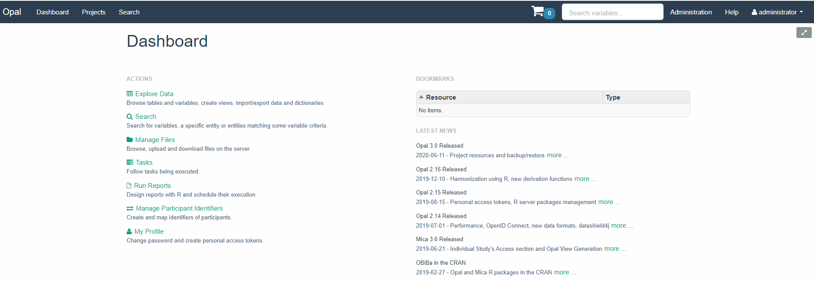
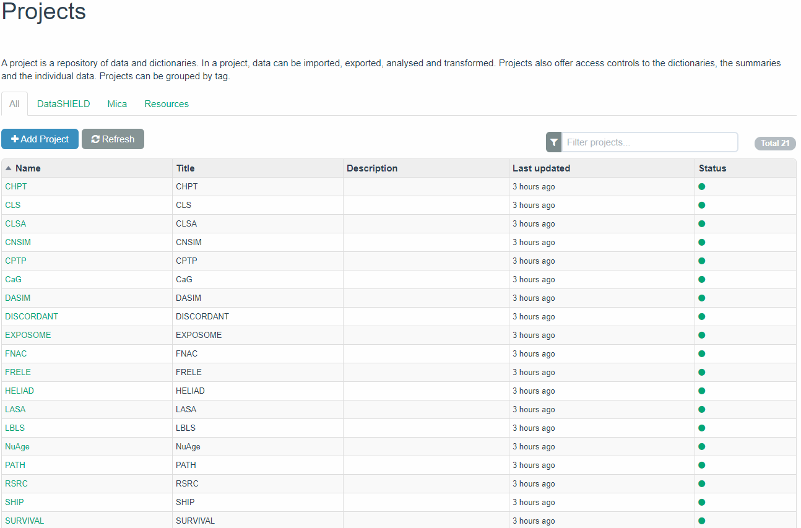
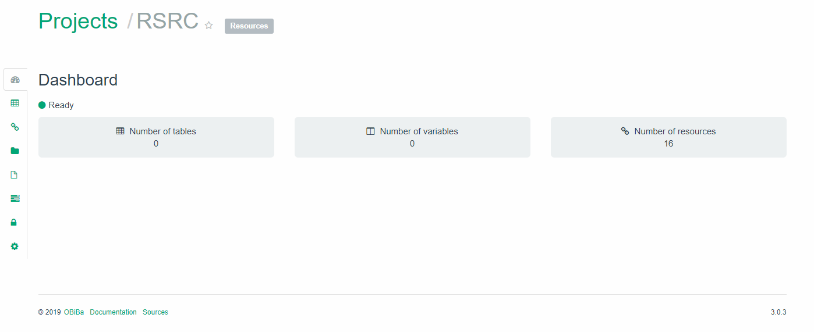
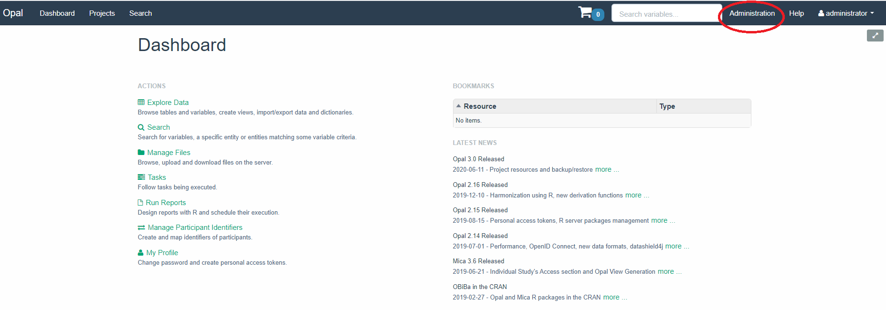
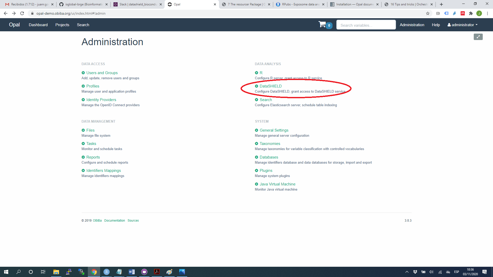
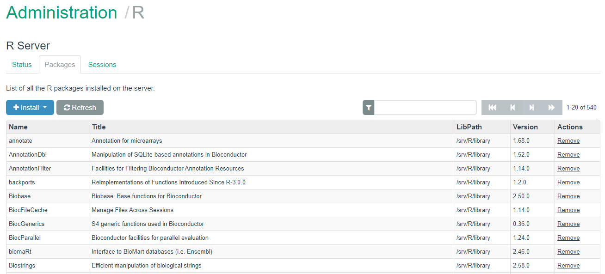

# Tips and tricks

The user can see in [this link](http://opaldoc.obiba.org/en/latest/admin/installation.html) how to create and install an Opal server. Next we illustrate how to deal with some of the basics for setting up a server to be used within DataSHIELD environment. 

In order to do that, we are using our Opal demo server available here: https://opal-demo.obiba.org/


This is the how an Opal looks like once the user enters the credentials:

- username: `administrator`
- password: `password`




## How to create a new project into OPAL

### Manually

The tab `Projects` (top-left) goes to the projects available in the Opal demo



A new project can be created by clicking on `+Add Project` tab. Then this information must be filled in 


### Using R

A project can be created using the following R code:

```{r eval=FALSE}
library(opalr)
o <- opal.login(username="administrator", password="password",
                url="https://opal-demo.obiba.org")
opal.project_create(o, "test", database="opal_data", title="This is a test", tags=list("Test"))
opal.logout(o)
```

See also the other `opal.project_*` functions.

## How to upload a new resource into OPAL

### Manually

Once a new project has been created, a new resource can be uploaded by clicking on project's name. In this case, let us assume that we are working on RSRC project that has been created to illustrate the main examples in this bookdown. After clicking on that project this window will appear



Here we can observe that this project contains 16 resources a no tables or variables. We can add a new resource by clicking on the "link tab" (see red circle)


Then a new resource can be added by clicking on the `+Add Resource` tab


Then this window will appear and information for your resource must be filled in


The different types of resources have been described Chapter \@ref(resourcer)

### Using R

A resource can be added to a project by a simple function call, assuming that you know how to express the URL to the resource:

```{r eval=FALSE}
library(opalr)
o <- opal.login("administrator","password", 
                url="https://opal-demo.obiba.org")
opal.resource_create(o, "RSRC", "CNSIM3", 
  url = "opal+https://opal-demo.obiba.org/ws/files/projects/RSRC/CNSIM3.zip", 
  format = "csv", secret = "EeTtQGIob6haio5bx6FUfVvIGkeZJfGq")
# to test the resource assignment
opal.assign.resource(o, "client", "RSRC.CNSIM3")
opal.execute(o, "class(client)")
opal.logout(o)
```

See also the other `opal.resource_*`functions.

## How to install DataSHIELD packages into OPAL server

### Manually



The tab `Administration` (red circle in the previous figure) allows the user access to the administration page




The `DataSHIELD` tab goes to the DataSHIELD administration details


The tab `+Add Package` allow the user to install a DataSHIELD package either from the DataSHIELD repository or any other GitHub site


### Using R

The user can also install DataSHIELD R packages from CRAN using the following R code:

```{r eval=FALSE}
library(opalr)
o <- opal.login(username="administrator", password="password",
                url="https://opal-demo.obiba.org")
dsadmin.install_package(o, "dsBase")
opal.logout(o)
```

A package from GitHub can also be installed by:

```{r eval=FALSE}
library(opalr)
o <- opal.login(username="administrator", password="password",
                url="https://opal-demo.obiba.org")
dsadmin.install_github_package(o, "packageName", username="orgOrUserName")
opal.logout(o)
```

## How to install R packages into OPAL server

### Manually

All the dependencies in a DataSHIELD package are automatically installed when installing it on the Opal Server. If necessary the user can also use the `+Install` button from the Administration/R tab



## Using R

The user can also install R packages from CRAN/Bioconductor using the following R code:

```{r eval=FALSE}
library(opalr)
o <- opal.login(username="administrator", password="password",
                url="https://opal-demo.obiba.org")
oadmin.install_bioconductor_package(o, "packageName")
opal.logout(o)
```

A package from GitHub can also be installed by:

```{r eval=FALSE}
library(opalr)
o <- opal.login(username="administrator", password="password",
                url="https://opal-demo.obiba.org")
oadmin.install_github_package(o, "packageName", username="orgOrUserName")
opal.logout(o)
```

