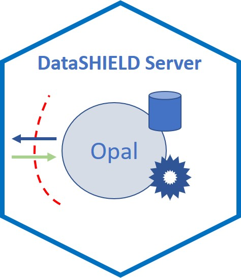

--- 
title: "Orchestrating non-disclosive big data analyses of data from different resources with R and DataSHIELD"
date: "`r Sys.Date()`"
site: bookdown::bookdown_site
documentclass: book
output_dir: "docs"
bibliography: [resource.bib, packages.bib]
biblio-style: apalike
link-citations: yes
---

```{r, setup, include=FALSE}
knitr::opts_chunk$set(comment="", warning=FALSE, message=FALSE, cache=TRUE,
                      fig.topcaption=TRUE, fig.path = "fig/")
library(BiocStyle)
library(kableExtra)
library(tidyverse)
```


# Welcome {-}

</a> 

This is the website for a book that provides users with some common workflows for the non-disclosive analysis of biomedical data with [R](https://cran.r-project.org/) and [DataSHIELD](http://www.datashield.ac.uk/) from different resources. This book will teach you how to use the `r BiocStyle::CRANpkg("resourcer")` R package to perform any statistcal analysis from different studies having data in different formats (e.g., CSV, SPSS, R class, ...). In particular, we focus on illustrating how to deal with Big Data by providing several examples from omic and geographical settings. To this end, we use cutting-edge Bioconductor tools to perform transcriptomic, epigenomic and genomic data analyses. Serveral R packages are used to perform analysis of geospatial data. We also provide examples of how performing non-disclosive analyses using secure SHELL commands by allowing the use of specific software that properly deals with Big Data outside R. This material serves as an online companion for the manuscript “Orchestrating non-disclosive big data analyses of shared data from different resources with R and DataSHIELD”.

While we focus here in genomic and geospatial data, dozens of data analysis aplications interested in performing non-disclosive analysis having data in any specific format could be carried out. By learning the grammar of DataSHIELD workflows, we hope to provide you a starting point for the exploration of your own data, whether it be omic, geospatial or otherwise.

This book is organized into five parts. In the Preamble, we introduce the book, provides a tutorial for key data infrastructure useful for omic and geospatial data and a general overview for learning how Opal and DataSHIELD allows performing non-disclosive data analyses from multiple studies simultaneously. So far, DataSHIELD uses tables from repository data in Opal which have some limitations to perfom Big Data analyses. 

The second part, Focus Topic, dive into information for non-disclosive analyses using any type of resource which is one of the key advances provided in this work. It allow, among others, perform big data analyses using genomic or geospatial information where thousand of sensitive data have to be managed.  

The third part, Resources Extensions, provides examples illustrating how to extend existing resources. We describe how to create functions to deal with omic data in [Variant Calling Format](https://en.wikipedia.org/wiki/Variant_Call_Format) (VCF files) which specifies the format of a text file used in bioinformatics for storing [gene sequence](https://en.wikipedia.org/wiki/Gene) variations. It also shows how to perform genomic data analysis using secure shell commands. This can be consider as an illustrative example for using shell programs to perform Big Data analyses that could be extend to other frameworks of Big Data such as “Apache Spark”. 

The fourth part, Workflows, provides primarily code detailing the analysis of various datasets throughout the book. Initially, we provide examples from transcriptomic, epigenomic and genomic association studies, as well as examples linking geospatial data where data confidentiality is an important issue. Exposome data analysis has also been added as another example of using *resources*.

The fifth part, Developers, provides information about how to develop DataSHIELD packages using specific R packages devoted to Big Data analyses as well as using shell programs. It also provides some useful trips and trick that developers or end users may face when using our proposed infrastructure.

Finally, the Appendix highlights our contributors.

If you would like to cite this work, please use the reference “Orchestrating non-disclosive big data analyses of data from different resources with R and DataSHIELD”.

```{r include=FALSE}
## automatically create a bib database for R packages
knitr::write_bib(c(
  .packages(), 'bookdown', 'knitr', 'rmarkdown'
), 'packages.bib')
library(BiocStyle)
library(kableExtra)
```


